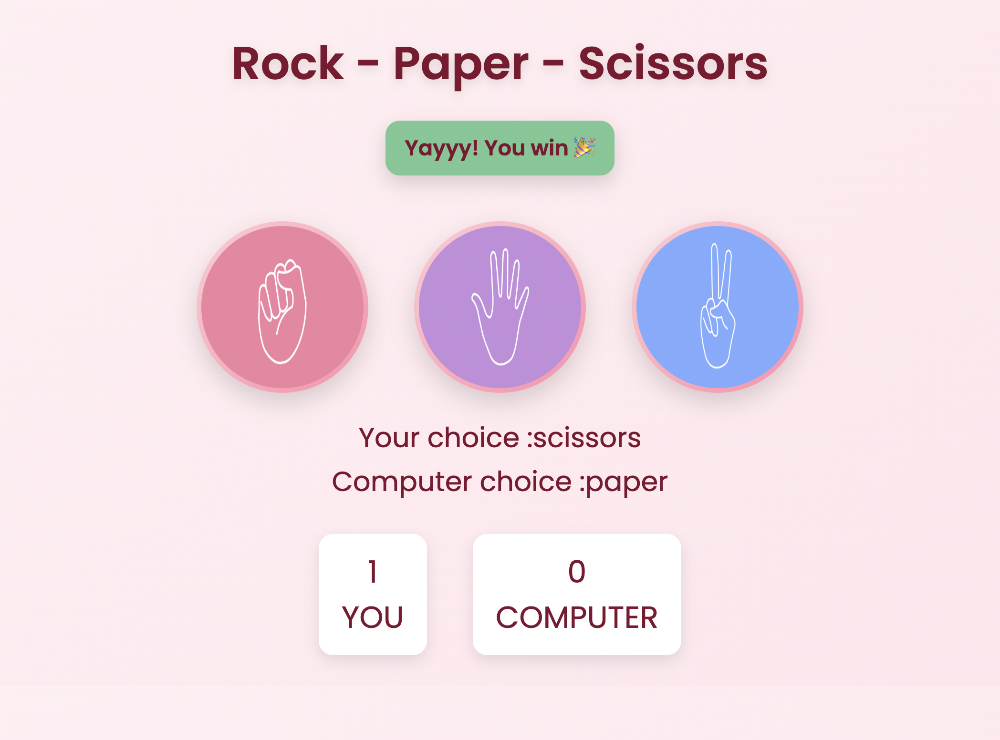

# 🎮 Rock Paper Scissors Game

An interactive **Rock Paper Scissors** web game built using HTML, CSS, and JavaScript.
This project demonstrates core concepts of **DOM manipulation, event handling, and game logic implementation**.

---

## 🌐 Live Demo

🔗 https://swasti03-builds.github.io/Rock-Paper-Scissors/

---

## ✨ Features

* 🎮 User vs Computer gameplay
* 🎲 Randomized computer moves
* 🏆 Real-time score tracking
* 🎨 Dynamic UI updates (color feedback on win/lose/draw)
* 💻 Responsive and interactive design

---

## 🛠️ Tech Stack

* HTML5
* CSS3
* JavaScript (Vanilla JS)

---

## 📂 Project Structure

```
rock-paper-scissors/
│── index.html
│── style.css
│── app.js
│── rock.png
│── paper.png
│── scissors.png
│── README.md
```

---

## ▶️ How to Run Locally

```bash
git clone https://github.com/your-username/repo-name.git
cd repo-name
open index.html
```

---

## 🎯 Game Rules

* Rock beats Scissors
* Scissors beats Paper
* Paper beats Rock

---

## 📸 Preview



---

## 🌱 Future Improvements

* 🔊 Sound effects
* 🎉 Animations for win/lose
* 🧠 AI-based opponent
* 📱 Mobile optimization

---

## 🙋‍♀️ Author

**Your Name**

* GitHub: https://github.com/Swasti03-builds/

---
